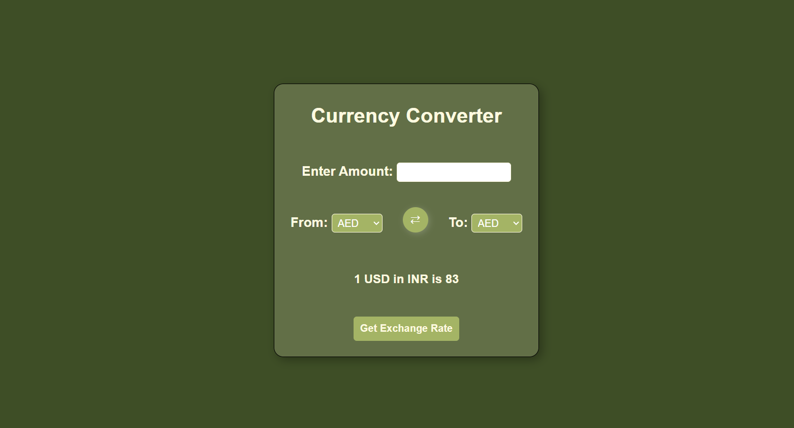

# 💰 Currency Converter

A simple web-based currency converter that fetches real-time exchange rates and converts between different currencies. Built with **HTML, CSS, and JavaScript**, this project allows users to select currencies and see real-time conversions.

---


## 🖼️ Preview  
  

---


## 🚀 Live Demo  
🔗 [Play the Game]( https://rambabupalla.github.io/Currency-Converter/)  

---


## 🚀 Features
- ✅ **Live Exchange Rates** using an API  
- ✅ **Easy Currency Selection** with dropdowns  
- ✅ **Responsive UI** with a modern design  
- ✅ **Swap Functionality** (optional if added)  
- ✅ **Error Handling** for invalid inputs  

---


## 📌 How to Use  
1. **Enter Amount** – Input the amount you want to convert.  
2. **Select Currencies** – Choose the currency to convert from and to.  
3. **Click Convert** – Press the "Convert" button to get the real-time exchange rate.  
4. **Swap Currencies** – Use the swap button to switch between "From" and "To" currencies.

---

## 🛠️ Technologies Used
- **HTML** - Structure  
- **CSS** - Styling  
- **JavaScript** - Logic & API calls  
- **ExchangeRate-API** - Fetch live rates

---

## 📦 Setup & Installation
1. **Clone the Repository**  
   ```sh
   git clone https://github.com/your-username/currency-converter.git
